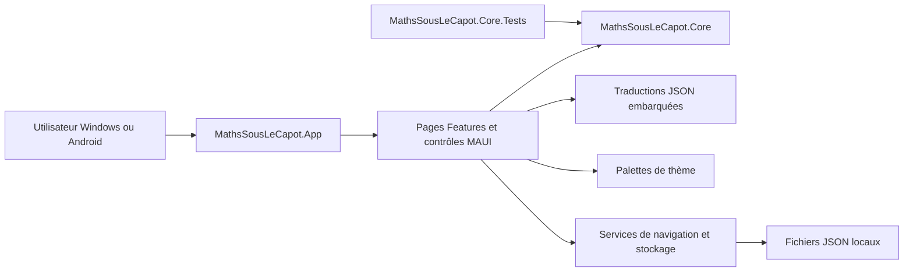
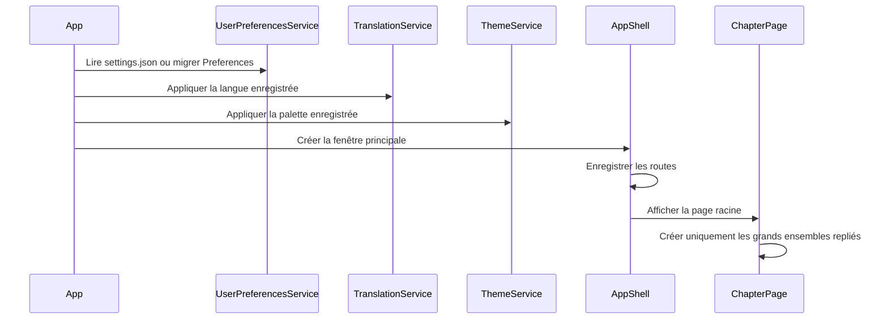
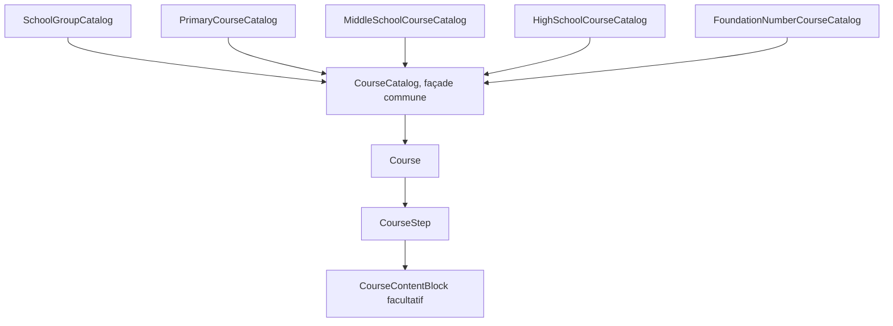
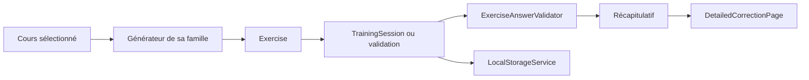
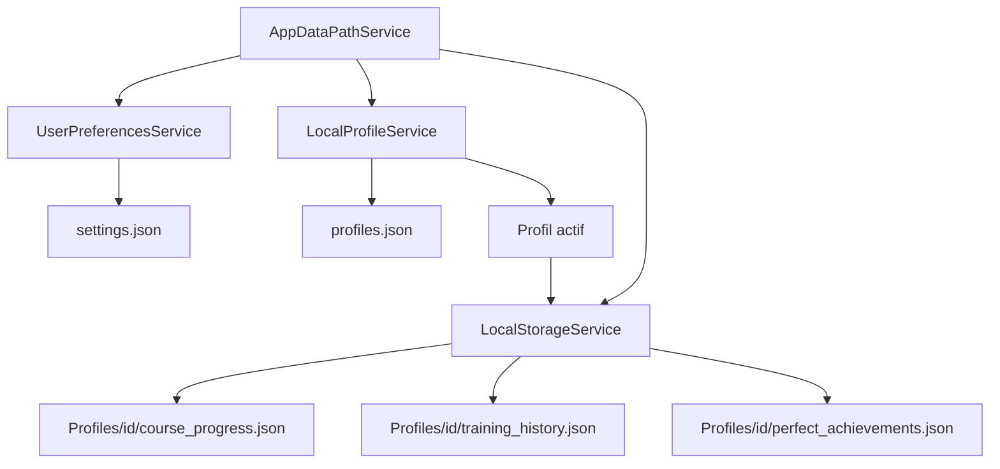

# Architecture actuelle

Ce document décrit l'architecture réellement implémentée de **Maths Sous le
capot** au 28 septembre 2026. Il sert de carte de lecture du code et doit évoluer
lorsqu'une responsabilité, une dépendance ou un flux structurant change.

## Vue générale



La dépendance principale est à sens unique : l'application MAUI référence le
cœur, tandis que le cœur ne référence ni MAUI, ni Windows, ni Android.

## Projets de la solution

### `MathsSousLeCapot.App`

Responsable de :

- l'interface XAML et C# ;
- la navigation Shell ;
- la création différée des vues ;
- les interactions, animations et visualisations ;
- la localisation des textes ;
- l'application des thèmes ;
- le choix de l'emplacement des données locales ;
- les points d'entrée Windows et Android.

### `MathsSousLeCapot.Core`

Responsable de :

- la description des cours et de leur progression ;
- les modèles pédagogiques ;
- les générateurs d'exercices et de contrôles ;
- la validation des réponses ;
- les calculs, conversions et représentations mathématiques ;
- les modèles et la sérialisation des données locales.

Le cœur doit rester testable sans initialiser MAUI.

### `MathsSousLeCapot.Core.Tests`

Projet xUnit couvrant les catalogues, modèles pédagogiques, générateurs,
validateurs, calculs et formats de stockage. Il ne constitue pas une suite de
tests d'interface MAUI.

## Dossiers principaux

| Dossier | Responsabilité |
|---|---|
| `src/MathsSousLeCapot.App/Features` | Pages regroupées par parcours fonctionnel |
| `src/MathsSousLeCapot.App/Controls` | Composants visuels réutilisables |
| `src/MathsSousLeCapot.App/Localization` | Chargement et utilisation des traductions |
| `src/MathsSousLeCapot.App/Services` | Navigation, thèmes, préférences et stockage |
| `src/MathsSousLeCapot.App/Resources` | Styles, icônes, contenus et JSON embarqués |
| `src/MathsSousLeCapot.App/Platforms` | Configuration propre à Windows et Android |
| `src/MathsSousLeCapot.Core/Courses` | Catalogues et modèles de cours |
| `src/MathsSousLeCapot.Core/Training` | Exercices, sessions, contrôles et validation |
| `src/MathsSousLeCapot.Core/Mathematics` | Logique mathématique indépendante |
| `src/MathsSousLeCapot.Core/Progress` | Modèles et sérialisation de la progression |
| `tests/MathsSousLeCapot.Core.Tests` | Tests unitaires et de cohérence du cœur |

## Démarrage de l'application



Les services ne passent pas actuellement par un conteneur d'injection de
dépendances. Les services simples sont construits directement et le service de
traduction expose une instance partagée.

## Chargement progressif du menu

`ChapterPage` utilise un état de déploiement possédant une fabrique exécutée une
seule fois par `EnsureLoaded()`.

1. Au démarrage, seuls les boutons des grands ensembles sont créés.
2. À l'ouverture d'un ensemble, les niveaux qui contiennent des cours sont
   ajoutés.
3. À l'ouverture d'un niveau, les cours de ce niveau sont obtenus depuis
   `CourseCatalog` et regroupés par catégorie.
4. À l'ouverture d'une catégorie, les cartes des cours sont créées.
5. À la sélection d'un cours, seule sa fiche et ensuite sa page sont construites.
6. Les exercices sont générés lors de la validation ou du démarrage d'une
   session, pas au lancement de l'application.

Ce comportement est une contrainte d'architecture : un nouveau module ne doit
pas reconstruire tous les cours ou toutes les visualisations au démarrage.

## Recherche de cours

`CourseSearchCatalog` expose un index différé contenant uniquement
l'identifiant, le titre, le niveau, la catégorie, le groupe scolaire et les tags
de chaque cours. Il ne construit ni les étapes pédagogiques, ni les exercices,
ni les visualisations.

`CourseSearchService` localise ces métadonnées puis effectue une recherche sans
tenir compte de la casse, des accents ou de la ponctuation. Un filtre peut
restreindre les résultats à un tag. La fiche complète du cours n'est construite
qu'après la sélection d'un résultat.

## Catalogues de cours



- `SchoolGroupCatalog` ordonne Fondations, Primaire, Collège et Lycée.
- `CourseCatalog` fournit les chapitres, résout un identifiant et rassemble les
  cours d'un niveau.
- les catalogues primaire, collège et lycée portent les grandes familles
  génériques ;
- `FoundationNumberCourseCatalog` est un nom technique historique pour les
  modules spécialisés des nombres négatifs et décimaux. Ces cours restent
  classés respectivement en 5e et CM1.
- le comptage, les opérations de fondation, le compteur décimal et la base deux
  disposent également de constructions spécialisées dans `CourseCatalog`.

Les identifiants de cours sont des contrats persistants : ils sont utilisés par
la navigation, les exercices, les prérequis, la progression et l'historique. Un
identifiant existant ne doit pas être renommé sans migration.

## Modèle pédagogique

Un `Course` contient :

- ses métadonnées et prérequis ;
- une liste ordonnée de `CourseStep` ;
- un indicateur de disponibilité ;
- un `CoursePedagogicalContent` facultatif.

Un `CourseStep` porte une idée principale et un type d'interaction. Ses
`CourseContentBlock` facultatifs permettent d'ordonner définition, intuition,
propriété, théorème, formule, méthode, exemple résolu, erreur fréquente,
visualisation et résumé.

Les champs enrichis sont facultatifs pour conserver la compatibilité avec les
cours créés selon l'ancien modèle. Les pages doivent donc accepter à la fois le
contenu structuré et l'ancien contenu court pendant la migration pédagogique.

## Familles de pages

Les premiers modules possèdent des pages dédiées :

- comptage ;
- compteur positionnel ;
- base deux ;
- addition et soustraction de fondation.

Les catalogues plus étendus réutilisent trois familles de pages génériques :

- `PrimaryCourses` ;
- `MiddleSchool` ;
- `HighSchool`.

Chaque famille fournit une fiche d'entrée, un cours et un entraînement. Les
nombres négatifs et décimaux utilisent la famille spécialisée
`FoundationNumbers`. `NavigationService` choisit la famille à partir de
l'identifiant du cours et centralise les routes Shell.

## Exercices et entraînements



Un `Exercise` conserve la question, la réponse correcte, le type de réponse,
les clés de traduction et, si nécessaire, un calcul posé ou une
`ExerciseSolution` structurée. Les anciens exercices restent valides grâce aux
champs enrichis facultatifs.

`ExerciseAnswerValidator` centralise la reconnaissance des réponses afin
d'éviter que chaque page réimplémente les règles sur les espaces, accents,
signes, nombres écrits ou valeurs de position.

La correction détaillée utilise en priorité `ExerciseSolution`. Pour les
exercices encore anciens, `DetailedExerciseExplanation` construit une
explication à partir de la clé et des arguments. Une explication minimale de
repli subsiste : sa suppression dépend de la migration pédagogique de toutes les
familles d'exercices.

## Contrôles intermédiaires

`ClassAssessmentGenerator` reçoit une clé de niveau, demande uniquement les
cours disponibles pour ce niveau, puis délègue chaque question au générateur de
la famille correspondante.

Il produit dix questions par défaut, alterne les cours disponibles et rejette
les signatures identiques dans la limite d'un nombre maximal de tentatives. Une
classe sans cours renvoie un contrôle vide au lieu de provoquer une erreur.

L'interface `ClassAssessmentPage` calcule le score et regroupe les résultats par
notion afin d'indiquer ce qui est maîtrisé ou à revoir.

## Calcul posé

Deux représentations complémentaires existent :

- `WrittenCalculationBuilder` et `WrittenCalculationView` produisent une pose
  complète destinée aux questions et corrections ;
- `GuidedCalculationPlanBuilder` et `GuidedWrittenCalculationView` découpent la
  pose en cases successives pour l'assistant primaire.

L'assistant ne renseigne pas le résultat à l'avance. Il active une case, valide
sa valeur, conserve les réponses correctes en vert puis passe à l'étape suivante.
Les étapes possibles couvrent chiffres de résultat, retenues, emprunts, produits
partiels, quotient, valeurs soustraites et restes.

La logique de construction du plan reste dans `Core`; le contrôle MAUI se charge
uniquement de la disposition, de la saisie et des couleurs.

## Traductions

Les traductions sont des ressources JSON embarquées sous
`Resources/Raw/lang`.

```text
lang/
├── index.json
├── fr_FR.json, en_US.json, es_ES.json, it_IT.json, ja_JP.json
├── primary/
├── primary-assistant/
├── highschool/
└── progress/
```

`index.json` déclare la langue française par défaut et les suppléments de chaque
langue. `TranslationService` charge d'abord le français complet, puis remplace
les clés disponibles par celles de la langue active. Une traduction manquante
peut ainsi retomber sur le français.

Les clés sont utilisées dans le XAML par `TranslateExtension` et dans le C# par
`Get` ou `Format`. Les paramètres comme `{0}` font partie du contrat de la clé.

## Thèmes

`ThemeCatalog` déclare les thèmes clair, sombre et sépia. Chaque
`ThemeDefinition` fournit une palette sémantique complète : couleurs
principales, fonds, textes, bordures, succès, erreurs et états de progression
des cartes de cours.

`ThemeService` reporte la palette dans les ressources MAUI. Les pages et
contrôles doivent demander une couleur sémantique au lieu d'introduire une
couleur locale sans justification.

## Profils, progression et défis

`LocalProfileService` gère plusieurs profils hors ligne. Le profil actif décide
du dossier lu par `LocalStorageService`, sans changer les identifiants de cours
présents dans les fichiers. Lors de la première utilisation, les anciens
fichiers de progression sont copiés vers le profil principal et conservés à
leur emplacement d'origine.

`LearningProgressCalculator`, situé dans le cœur, calcule les statistiques et
les défis depuis `CourseProgress` et `TrainingSession`. Une session vérifiée
compte au maximum une fois pour chaque couple cours/difficulté. Sa valeur de
base est de 1 point en Fondations/Primaire, 3 au Collège et 5 au Lycée ; les
difficultés facile, modérée et difficile ajoutent respectivement 0, 1 et 3
points. Les défis terminés ajoutent leur propre récompense.

`CourseAchievementCalculator` donne la priorité au meilleur état connu : lu,
sans faute, puis sans faute en difficile. `LocalStorageService` maintient
`perfect_achievements.json`, un résumé ne contenant ni énoncé ni réponse. Lors
de la première ouverture suivant une mise à jour, ce résumé peut être reconstruit
une fois depuis l'ancien historique ; les ouvertures suivantes du menu ne
désérialisent plus toutes les sessions.

L'historique de l'écran « Mon parcours » est matérialisé par tranches de dix
sessions. Le classement compare uniquement les profils du même appareil.

## Stockage local



`AppDataPathService` choisit le dossier :

- `Data` à côté de l'exécutable pour la version Windows portable lorsque ce
  dossier existe ;
- `%LOCALAPPDATA%\MathsSousLeCapot\Data` pour Windows classique ;
- le dossier privé MAUI de l'application sur Android.

Les services migrent les anciennes valeurs MAUI Preferences lorsqu'aucun
fichier JSON n'existe. Les modèles persistés doivent rester compatibles ou être
accompagnés d'une migration explicite.

`settings.json` reste commun à l'application. `profiles.json` répertorie les
profils et le profil actif. Chaque sous-dossier `Profiles/<id>` isole ensuite la
progression et les entraînements de son utilisateur.

## Invariants à préserver

1. `MathsSousLeCapot.Core` ne dépend pas de MAUI.
2. Les identifiants de cours et les clés de traduction restent stables.
3. Un contrôle de classe ne pioche que dans son niveau.
4. Les exercices ne sont générés qu'au moment où ils sont nécessaires.
5. Les cartes de cours et visualisations ne sont pas toutes créées au démarrage.
6. Les réponses sont validées par les règles partagées, pas par des comparaisons
   dispersées dans les pages.
7. Les nouveaux champs des modèles restent facultatifs pendant les migrations.
8. Les données locales existantes ne sont jamais supprimées implicitement.
9. Les couleurs visibles proviennent des palettes sémantiques.
10. Une fonctionnalité annoncée comme vérifiée doit citer la validation
    réellement exécutée.

## Points d'extension principaux

| Besoin | Point d'entrée |
|---|---|
| Ajouter ou classer un cours | Catalogues sous `Core/Courses` |
| Ajouter ou modifier un tag | `CourseSearchCatalog` et catalogues de traduction `progress` |
| Ajouter un type d'exercice | Enumération et générateur sous `Core/Training` |
| Modifier la reconnaissance d'une réponse | `ExerciseAnswerValidator` et convertisseurs de nombres |
| Ajouter une page spécialisée | `App/Features` et `NavigationService` |
| Ajouter un composant visuel partagé | `App/Controls` |
| Ajouter une langue ou un supplément | `Resources/Raw/lang/index.json` et catalogues JSON |
| Ajouter un thème | `ThemeCatalog` et `ThemeDefinition` |
| Faire évoluer les données locales | Modèles `Core/Progress`, sérialiseur et services de stockage |
| Ajouter un défi ou modifier le score | `LearningProgressCalculator` avec tests dédiés |
| Ajouter une règle mathématique | Sous-dossier adapté de `Core/Mathematics` avec tests |

La procédure détaillée d'ajout d'un cours sera documentée dans une phase
suivante. En attendant, toute extension doit être accompagnée des tests de
catalogue, de génération, de traduction et de navigation concernés.
